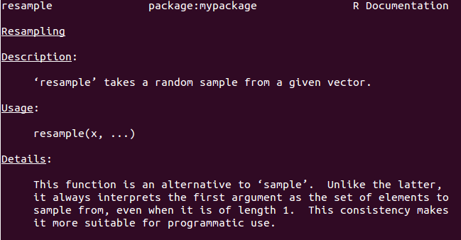
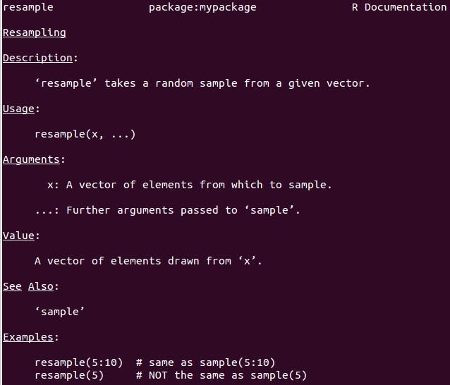

## What is an R package?

"Packages are the fundamental units of reproducible R code." (Hadley Wickham)

"R packages are the best way to distribute R code and documentation..." (Karl
Broman)

---

## Why R packages?

* Save time

    - Follow conventions, avoid having to think about 'plumbing'
    - Quick & easy re-use
    - Quick & easy sharing

* Better code

    - Easier check & test
    - Easier to document
    * Tidier namespaces

* Easy to create

- Helpful even when writing code just for yourself

---

## General advice

Start slowly

Don't need to learn everything at once

---

## Overview

1. Your first R package

2. Efficient workflow

3. Improving and sharing your package

4. Managing packages

---

## `functions.R`, the poor man's R package

1. Place function definitions in a file called `functions.R`

2. Load this in other scripts using `source("function.R")`

---

## Examples

In `functions.R`:
```
# Calculate the square of x.
square <- function(x)
    x^2
```

In your R session:
```{r}
source("functions.R")
square(1:3)
```

---

## Examples

In `functions.R`:
```{r eval=FALSE}
# Resample values from a given vector.
resample <- function(x, ...)
    x[sample.int(length(x), ...)]
```

In your R session:
```{r}
source("functions.R")
resample(letters[1:10])
```

---

## Your first R package

Create folder structure

```
mypackage/
└── R/
```

---

## Your first R package

Move `functions.R` into the `R` subfolder

```
mypackage/
└── R/
    └── functions.R
```

---

## Your first R package

Create the `DESCRIPTION` and `NAMESPACE` files

```
mypackage/
├── R/
│   └── functions.R
├── DESCRIPTION
└── NAMESPACE
```

---

## Your first R package

Your `DESCRIPTION` file should look similar to:

```
Package: mypackage
Title: This is my first R package
Description: This package was created as a way to learn how to write R
    packages. It contains various helper functions and variable definitions.
Authors@R: person("First", "Last", email = "first.last@example.com",
                  role = c("aut", "cre"))
Version: 0.1
Depends: R (>= 3.3.1)
License: GPL-3
LazyData: true
```

---

## Your first R package

Your `NAMESPACE` file should look like:

```
# Export all names
exportPattern(".")
```

---

## Your first R package

Install your package:

```
R CMD INSTALL mypackage
```

(Run this on the command line, from the folder one level above `mypackage`)

---

## Your first R package

Use your new package in R:

```{r}
library(mypackage)
square(1:3)
resample(letters[1:10])
```

---

## Your first R package

Can split up your code into any number of `.R` files

```
mypackage/
├── R/
│   ├── resample.R
│   └── square.R
├── DESCRIPTION
└── NAMESPACE
```

All `.R` files within the `R` subfolder will automatically be included in your
package

(More convenient than if `source()`-ing)


---

## Benefits of packages (vs `functions.R`)

* Easier to re-use
* Easier to share
* Easier to maintain as complexity increases
* Better documentation
* Cleaner project code

---

## Modern development toolkit

* `devtools`: Hadley Wickham's R package for 'painless package development'
* `roxygen2`: In-source documentation system
* `testthat`: 'Tools to make testing fun :)'
* `knitr`: Dynamic report generation

Highly recommended!

Grab the whole kit:

```{r eval=FALSE}
install.packages(c("devtools", "roxygen2", "testthat", "knitr"))
```

---

## Using `devtools`

Starting a new package:

```{r eval=FALSE}
library(devtools)
create("mypackage")
```

This sets up the basic folder structure and files (`DESCRIPTION`, etc.)

---

## Workflow comparison

              | Old way                   | New way
------------- | ------------------------- | -------------------------
Development   | `source("functions.R")`   | `load_all("mypackage")`
Use           | `source("functions.R")`   | `library("mypackage")`

---

## Development workflow

1. Edit code in `R` subfolder

2. In an R session:

    (a) `load_all("mypackage")`

    (b) Test out your functions

3. Repeat until happy

4. `install("mypackage")`

---

## Documentation

> - Help pages are accessed by using `?` or  `help()`

> - For example: `?read.table`

> - R packages should provide help pages as well as code

> - R packages follow specific conventions for documentation.  These used to be
difficult to follow

> - `roxygen2` allows you to write documentation as *inline comments* in your
`.R` files

> - `devtools` makes the whole process easy

---

## Writing basic `roxygen2` comments

> - Place comments directly above your code

> - Use ``#` `` instead of `#`

> - First 3 blocks of text: Title, Description, Details

> - Include the `@export` tag (will explain later...)

---

## Example

```{r eval=FALSE}
#' Resampling
#'
#' \code{resample} takes a random sample from a given vector.
#'
#' This function is an alternative to \code{sample}.  Unlike the latter, it
#' always interprets the first argument as the set of elements to sample from,
#' even when it is of length 1.  This consistency makes it more suitable for
#' programmatic use.
#'
#' @export
resample <- function(x, ...)
    x[sample.int(length(x), ...)]
```

---

## Example output



---

## Documentation workflow

1. Edit `roxygen2` comments

2. In an R session:

    (a) `document("mypackage")`

    (b) Inspect help pages using `?`

3. Repeat until happy

4. `install("mypackage")`

---

## Tips

Remember to run `library(devtools)` before doing any development.

Hadley recommends adding it to your startup file (`.Rprofile`):

```{r eval=FALSE}
if (interactive())
    suppressMessages(require(devtools))
```

---

## Next steps

* More documentation

* Dependencies (imports)

* Namespaces (exports)

* Sharing your package

---

## More documentation

Use `roxygen2` tags (`@param`, `@return`,...) to add sections beyond the 3 basic blocks

Some standard sections for function definitions:

* Descriptions of the **Arguments** (`@param`)
* Description of the return **Value** (`@return`)
* References to related functions, **See Also** (`@seealso`)
* **Examples** of use (`@examples`)

---

## Example

```{r eval=FALSE}
#' Resampling
#'
#' \code{resample} takes a random sample from a given vector.
#'
#' @export
#' @param x   A vector of elements from which to sample.
#' @param ... Further arguments passed to \code{sample}.
#' @return A vector of elements drawn from \code{x}.
#'
#' @seealso \code{\link[base]{sample}}
#'
#' @examples
#' resample(5:10)  # same as sample(5:10)
#' resample(5)     # NOT the same as sample(5)
resample <- function(x, ...)
    x[sample.int(length(x), ...)]
```

---

## Example output



---

## Checking your examples

Use `run_examples()` to verify that your examples work

---

## Examples example

```{r eval=FALSE}
> library(devtools)
> run_examples("mypackage")
Updating mypackage documentation
Loading mypackage
Writing resample.Rd
Running 3 example files in mypackage ------------------------------
Loading mypackage
Running examples in resample.Rd -----------------------------------
> 
> resample(5:10)  # same as sample(5:10)
[1]  5  9  6 10  8  7
> resample(5)     # NOT the same as sample(5)
[1] 5
Loading mypackage
```

---

## Dependencies

> - Never use `library()` or `require()` or `source()` in package code

> - Invoke functions from other packages using `package::function()`

> - List all such external packages in the `Imports` section of the
`DESCRIPTION` file

> - This will ensure these packages are installed along with
your package

> - Easy way: run `use_package("package")` in your R session

---

## Dependencies

Write R code:

```{r eval=FALSE}
#' Plot Error Bars and Confidence Intervals
plotCI <- function(..., sfrac = 0,     gap = 0,   pch = 19)
    gplots::plotCI(..., sfrac = sfrac, gap = gap, pch = pch)
```

In an R session, declare the dependency:

```{r eval=FALSE}
use_package("gplots")
```

The `DESCRIPTION` now says:

```
Package: mypackage
Title: This is my first R package
...
Imports: gplots
```

---

## Visibility to end users

> - `NAMESPACE` defines which functions will be available to users of the package

> - Typically best to only expose the 'high-level' functions

> - This is called 'exporting' the function

---

## Visibility to end users

Workflow:

1. Add the `@export` tag to desired functions

2. Use `document()` to automatically create `NAMESPACE`

---

## Visibility to end users

Edit code to add the `@export` tag:

```{r eval=FALSE}
#' @export
resample <- function(x, ...)
    x[sample.int(length(x), ...)]
```

In an R session, run:

```{r eval=FALSE}
document("mypackage")
```

The `NAMESPACE` now says:

```{r eval=FALSE}
export(resample)
```

---

## Sharing your R package

Some options (in order of accessibility):

* Submit to the [Comprehensive R Archive Network (CRAN)][cran]
* Push to [GitHub][github]
* Post on a website
* Send directly to colleagues

[cran]: https://cran.r-project.org/
[github]: https://github.com/

---

## [GitHub](https://github.com/)

A de facto modern standard (after CRAN...)

* Nice website
* Easy access/distribution (`install_github()` using `devtools`)
* Easy collaboration
* Version control
* Integrated into RStudio
* Free

Would need to learn [Git](https://git-scm.com/)...but you should anyway!

Alternatives: [GitLab](https://about.gitlab.com/), [Bitbucket](https://bitbucket.org/)

---

## Sharing as a file

Easiest options:

* Zip up your package folder ('source' package)
* `build("mypackage")` ('bundled' package)

Then send to colleagues, post on websites, etc.

---

## Tidying up before sharing

Consider the following:

* [Author list][author]
- [Version number][version]
- [Software licence][licence]
* [Add a `README.md`][readme]

[author]: http://r-pkgs.had.co.nz/description.html#author
[version]: http://r-pkgs.had.co.nz/description.html#version
[licence]: http://r-pkgs.had.co.nz/description.html#license
[readme]: http://r-pkgs.had.co.nz/release.html#readme

---

## Topics not covered today

* Dealing with more complex objects: classes, methods, etc.
* [Types of packages](http://r-pkgs.had.co.nz/package.html#package)
  (source, bundled, binary,...)
* [Types of dependencies](http://r-pkgs.had.co.nz/description.html#dependencies)
  (Imports, Suggests, Depends,...)
* [Namespace imports](http://r-pkgs.had.co.nz/namespace.html#imports)
* [Text formatting](http://r-pkgs.had.co.nz/man.html#text-formatting) in
  documentation
* [Automated testing](http://r-pkgs.had.co.nz/tests.html)
* [Including data](http://r-pkgs.had.co.nz/data.html)
* [Including C and C++ code](http://r-pkgs.had.co.nz/src.html)
* [Writing 'vignettes'](http://r-pkgs.had.co.nz/vignettes.html)
  (longer guides & tutorials)
* [Submitting packages to CRAN](http://r-pkgs.had.co.nz/release.html)
* Using [RStudio](https://www.rstudio.com/)

See [Hadley Wickham's guide][hadley] for more details

[hadley]: http://r-pkgs.had.co.nz/

---

## A complete workflow

1. `create()`
2. Write code, `load_all()`, fix & repeat
3. Write `roxygen2` comments, `document()`, fix & repeat
4. (Write tests, `test()`, fix & repeat)
5. (Include data, `load_all()`, fix & repeat)
6. (Write vignettes)
7. Check NAMESPACE is correct, `document()`, fix & repeat
8. Run `check()`, fix & repeat
9. Update `DESCRIPTION` (e.g. new version number)
10. Final `check()`
11. Release (GitHub, CRAN, ...)
12. Publicise!

---

## Organising your code

Package up your code in a way that best promotes re-use:

> - Generic but frequently used code  
→ Personal/miscellaneous utility package  
Examples: `gplots`, `Hmisc`, `rafalib`

> - Standalone utility code specific to a context (e.g. data parsing)  
→ Specific utility package  
Examples: `devtools`, `ggplot2`, `data.table`, `stringr`

> - General modelling code  
→ Modelling package  
Examples: `randomForest`, `lme4`, `forecast`

> - Project code  
→ Project package

---

## Managing R packages

* Installing

* Upgrading

* Finding and installing dependencies

* Re-installing packages after a major R upgrade

* Where are R packages installed?

---

## Installing packages

Source            | With `devtools`                      | Traditional way
----------------- | ------------------------------------ | -----------------------------
Local file/folder | `install("package")`                 | `R CMD INSTALL package`
CRAN              | `install_cran("package")`            | `install.packages("package")`
GitHub            | `install_github("username/package")` |
Other             | `install_*()` functions              |

---

## Installing packages

To ensure you have the latest version of all dependencies for a package, install using:

```{r eval=FALSE}
library(devtools)
update_packages("package")
```

---

## Upgrading (all) packages

Quick and easy:

```{r eval=FALSE}
library(devtools)
update_packages()
```

For more fine-grained control:

```{r eval=FALSE}
update.packages()
```

---

## Finding and installing dependencies

You have a folder full of **scripts**, each depending on various packages

Use the `reinstallr` package to install them all:

```{r eval=FALSE}
library(reinstallr)
reinstallr("path/to/folder")
```

---

## Re-installing packages after a major R upgrade

You've done an R upgrade and all of your packages are missing?

Re-install them (CRAN packages only) by running:

```{r eval=FALSE}
update.packages(checkBuilt = TRUE, ask = FALSE)
```

---

## Where are R packages installed?

A 'library' is a folder for storing installed packages

```{r}
.libPaths()
```

This can be useful for debugging your R installation

---

## General advice

Start slowly

Don't need to learn everything at once

---

## More info

Quick start:

* [Writing an R package from scratch][hilary], Hilary Parker

Modern guides:

* [R packages][hadley], Hadley Wickham **(read this!)**
* [Package Development Cheat Sheet][devcheat] for `devtools` & RStudio

Older guides:

* [R package primer][broman], Karl Broman
* [Writing R Extensions][R-exts], R Core Team **(for experts only...)**

[hilary]: https://hilaryparker.com/2014/04/29/writing-an-r-package-from-scratch/
[broman]: http://kbroman.org/pkg_primer/
[hadley]: http://r-pkgs.had.co.nz/
[R-exts]: https://cran.r-project.org/doc/manuals/r-release/R-exts.html
[devcheat]: https://www.rstudio.com/wp-content/uploads/2015/06/devtools-cheatsheet.pdf

---

## More info

Tips for using RStudio:

* [Package Development support pages][rstudio-pkg-dev]
* [Package Development Cheat Sheet][devcheat]
* Some keyboard shortcuts:

    - `Ctrl/Cmd + Shift + L` invokes `load_all()`
    - `Ctrl/Cmd + Shift + D` invokes `document()`

[rstudio-pkg-dev]: https://support.rstudio.com/hc/en-us/sections/200130627-Package-Development
[devcheat]: https://www.rstudio.com/wp-content/uploads/2015/06/devtools-cheatsheet.pdf

Useful packages:

* [devtools](https://github.com/hadley/devtools)
* [reinstallr](https://github.com/calligross/reinstallr)
* [installr](https://github.com/talgalili/installr/) (Windows only)

---

## More info

(Add links to this presentation, my contact details, etc.)

TODO
